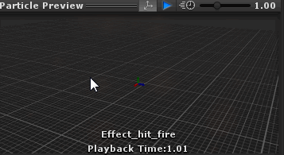

# Unity ParticleSystem Preview 粒子系统预览工具

UnityParticleSystemPreview 是一个像模型动作动画那样可以直接在检视器里进行预览粒子的工具。

- Show - 显示粒子系统预览窗口
- Pivot - 显示avatar的轴心和质心
- Floor - 显示地板
- Play - 播放粒子系统
- Auto Play - 自动播放
- Speed Slider - 改变粒子预览速度

## 安装

- 通过【Package Manager】包管理器，添加git URL地址：https://github.com/akof1314/UnityParticleSystemPreview.git

## 源码
AssetStore 地址：https://assetstore.unity.com/packages/tools/utilities/particle-system-preview-73346

Github 地址：https://github.com/akof1314/UnityParticleSystemPreview